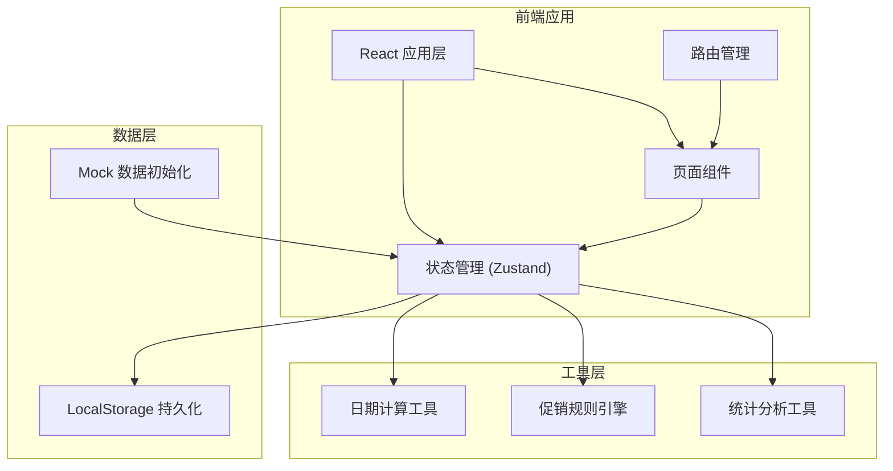
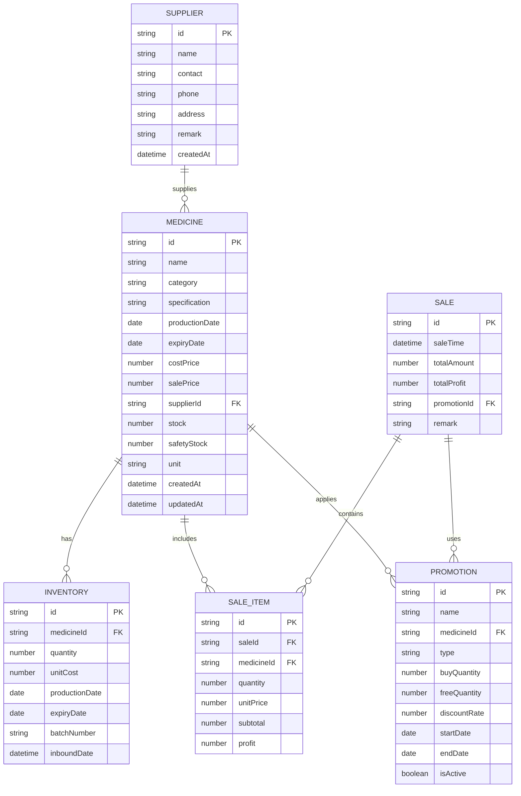

## 1. 架构设计



## 2. 技术描述

- **前端框架**: React@18 + TypeScript + Vite
- **状态管理**: Zustand
- **路由**: React Router DOM@6
- **样式**: TailwindCSS@3
- **图表**: Recharts
- **图标**: Lucide React
- **数据持久化**: LocalStorage
- **后端**: 无后端，纯前端应用，数据存储在浏览器本地

## 3. 路由定义

| 路由 | 页面 | 功能 |
|------|------|------|
| / | Dashboard | 仪表板，展示过期提醒、库存预警、今日概览 |
| /medicines | MedicineList | 药品管理列表 |
| /medicines/new | MedicineForm | 新增药品 |
| /medicines/:id/edit | MedicineForm | 编辑药品 |
| /inventory | InventoryList | 库存管理列表 |
| /inventory/inbound | InventoryInbound | 入库操作 |
| /sales | SaleList | 销售记录列表 |
| /sales/new | SaleForm | 销售出库 |
| /promotions | PromotionList | 促销活动列表 |
| /promotions/new | PromotionForm | 新增促销活动 |
| /suppliers | SupplierList | 供应商列表 |
| /suppliers/new | SupplierForm | 新增供应商 |
| /suppliers/:id/edit | SupplierForm | 编辑供应商 |
| /statistics | Statistics | 统计分析页面 |

## 4. 数据模型

### 4.1 实体关系图



### 4.2 类型定义

```typescript
// 药品分类
type MedicineCategory = 'cold' | 'hypertension' | 'anti-inflammatory' | 'vitamin' | 'other';

// 促销类型
type PromotionType = 'buy_n_get_m' | 'discount';

// 药品
interface Medicine {
  id: string;
  name: string;
  category: MedicineCategory;
  specification: string;
  productionDate: string;
  expiryDate: string;
  costPrice: number;
  salePrice: number;
  supplierId: string;
  stock: number;
  safetyStock: number;
  unit: string;
  createdAt: string;
  updatedAt: string;
}

// 供应商
interface Supplier {
  id: string;
  name: string;
  contact: string;
  phone: string;
  address: string;
  remark: string;
  createdAt: string;
}

// 入库记录
interface InventoryRecord {
  id: string;
  medicineId: string;
  quantity: number;
  unitCost: number;
  productionDate: string;
  expiryDate: string;
  batchNumber: string;
  inboundDate: string;
}

// 销售单
interface Sale {
  id: string;
  saleTime: string;
  totalAmount: number;
  totalProfit: number;
  promotionId?: string;
  remark: string;
  items: SaleItem[];
}

// 销售明细
interface SaleItem {
  id: string;
  medicineId: string;
  medicineName: string;
  quantity: number;
  unitPrice: number;
  subtotal: number;
  profit: number;
}

// 促销活动
interface Promotion {
  id: string;
  name: string;
  medicineId: string;
  type: PromotionType;
  buyQuantity: number;
  freeQuantity: number;
  discountRate: number;
  startDate: string;
  endDate: string;
  isActive: boolean;
}

// 过期预警
interface ExpiryAlert {
  medicine: Medicine;
  daysRemaining: number;
  level: 'critical' | 'warning' | 'normal';
}

// 库存预警
interface StockAlert {
  medicine: Medicine;
  stockPercentage: number;
  level: 'critical' | 'warning' | 'normal';
}
```

## 5. 状态管理设计

### 5.1 Store 结构

```typescript
interface AppState {
  // 数据
  medicines: Medicine[];
  suppliers: Supplier[];
  sales: Sale[];
  promotions: Promotion[];
  inventoryRecords: InventoryRecord[];
  
  // 操作
  loadData: () => void;
  saveData: () => void;
  
  // 药品操作
  addMedicine: (medicine: Omit<Medicine, 'id' | 'createdAt' | 'updatedAt'>) => void;
  updateMedicine: (id: string, data: Partial<Medicine>) => void;
  deleteMedicine: (id: string) => void;
  
  // 供应商操作
  addSupplier: (supplier: Omit<Supplier, 'id' | 'createdAt'>) => void;
  updateSupplier: (id: string, data: Partial<Supplier>) => void;
  deleteSupplier: (id: string) => void;
  
  // 销售操作
  createSale: (items: SaleItem[], promotionId?: string) => Sale;
  
  // 库存操作
  addInventory: (record: Omit<InventoryRecord, 'id'>) => void;
  
  // 促销操作
  addPromotion: (promotion: Omit<Promotion, 'id'>) => void;
  updatePromotion: (id: string, data: Partial<Promotion>) => void;
  
  // 计算属性
  getExpiryAlerts: (days?: number) => ExpiryAlert[];
  getStockAlerts: () => StockAlert[];
  getDailySales: (date: string) => { amount: number; count: number; profit: number };
  getTopSellers: (period: 'week' | 'month' | 'all', limit?: number) => Array<{ medicine: Medicine; quantity: number; amount: number; profit: number }>;
  getPromotionEffect: (promotionId: string) => { normalSales: number; promotionSales: number; increaseRate: number };
}
```

## 6. 工具函数设计

### 6.1 日期计算工具

```typescript
// 计算两个日期之间的天数差
function daysBetween(date1: Date, date2: Date): number

// 计算距离过期的天数
function daysToExpiry(expiryDate: string): number

// 判断药品是否在有效期内
function isValid(productionDate: string, expiryDate: string): boolean

// 获取过期预警等级
function getExpiryAlertLevel(daysRemaining: number): 'critical' | 'warning' | 'normal'
```

### 6.2 促销规则引擎

```typescript
// 检查促销是否适用于当前时间
function isPromotionActive(promotion: Promotion, date?: Date): boolean

// 计算促销价格
function calculatePromotionPrice(
  medicine: Medicine,
  quantity: number,
  promotion: Promotion
): { finalQuantity: number; finalPrice: number; freeQuantity: number }

// 查找当前可用的促销
function findActivePromotion(medicineId: string, promotions: Promotion[]): Promotion | null
```

### 6.3 统计分析工具

```typescript
// 按时间段汇总销售数据
function aggregateSalesByPeriod(
  sales: Sale[],
  period: 'day' | 'week' | 'month'
): Array<{ period: string; amount: number; profit: number }>

// 计算药品利润率
function calculateProfitRate(costPrice: number, salePrice: number): number

// 计算促销效果
function calculatePromotionEffect(
  sales: Sale[],
  promotion: Promotion
): { normalSales: number; promotionSales: number; increaseRate: number }
```

## 7. 项目结构

```
src/
├── components/          # 可复用组件
│   ├── AlertCard.tsx    # 预警卡片
│   ├── MedicineCard.tsx # 药品卡片
│   ├── Modal.tsx        # 弹窗组件
│   ├── Navbar.tsx       # 导航栏
│   ├── StatCard.tsx     # 统计卡片
│   └── Table.tsx        # 表格组件
├── pages/               # 页面组件
│   ├── Dashboard.tsx
│   ├── medicine/
│   │   ├── List.tsx
│   │   └── Form.tsx
│   ├── inventory/
│   │   ├── List.tsx
│   │   └── Inbound.tsx
│   ├── sales/
│   │   ├── List.tsx
│   │   └── New.tsx
│   ├── promotions/
│   │   ├── List.tsx
│   │   └── Form.tsx
│   ├── suppliers/
│   │   ├── List.tsx
│   │   └── Form.tsx
│   └── Statistics.tsx
├── store/               # 状态管理
│   └── useStore.ts
├── types/               # 类型定义
│   └── index.ts
├── utils/               # 工具函数
│   ├── date.ts
│   ├── promotion.ts
│   └── statistics.ts
├── mock/                # Mock 数据
│   └── initData.ts
├── App.tsx
├── main.tsx
└── index.css
```
