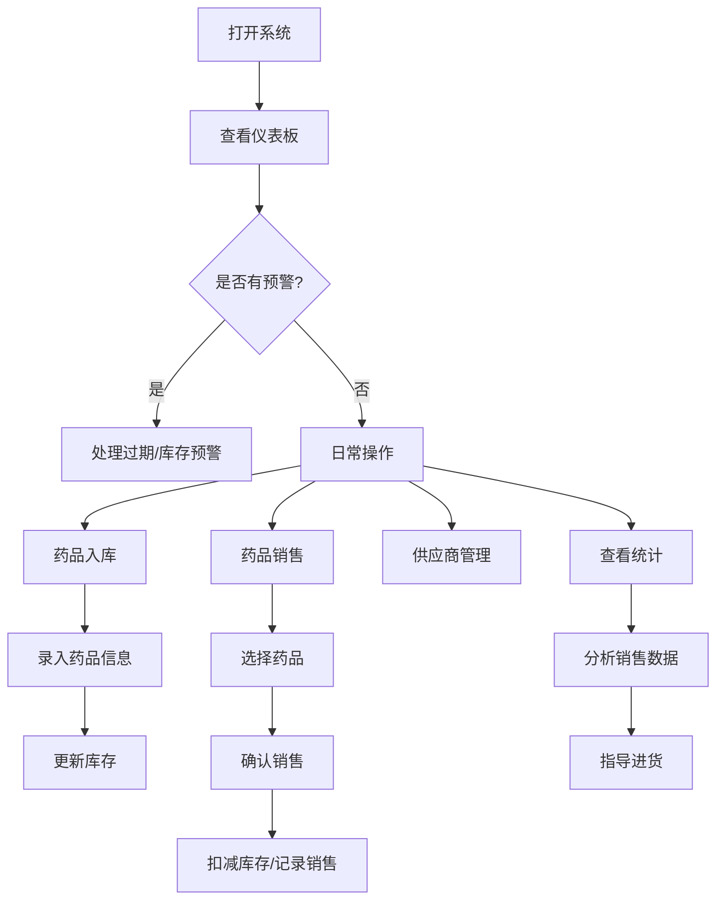

## 1. 产品概述
为小型药店提供药品有效期、库存、供应商和销售管理的一站式管理工具，帮助药店避免药品过期损失，优化库存管理，提升经营效率。

## 2. 核心功能

### 2.1 用户角色
| 角色 | 注册方式 | 核心权限 |
|------|----------|----------|
| 药店管理员 | 本地使用，无需注册 | 所有功能的管理操作 |

### 2.2 功能模块
1. **仪表板**：过期提醒、库存预警、今日销售概览
2. **药品管理**：药品信息录入、编辑、删除，分类管理（感冒药、降压药、消炎药、维生素等）
3. **库存管理**：库存查询、入库操作、安全库存设置、低库存预警
4. **销售管理**：销售出库、销售记录查询、促销活动管理
5. **供应商管理**：供应商信息录入、编辑、删除，联系方式管理
6. **统计分析**：销售排行、利润分析、促销效果分析

### 2.3 页面详情
| 页面名称 | 模块名称 | 功能描述 |
|----------|----------|----------|
| 仪表板 | 过期提醒 | 显示30天内即将过期的药品列表，按剩余天数排序 |
| 仪表板 | 库存预警 | 显示低于安全库存的药品列表 |
| 仪表板 | 今日概览 | 显示今日销售额、销售量、毛利 |
| 药品管理 | 药品列表 | 展示所有药品，支持按分类、名称搜索 |
| 药品管理 | 药品表单 | 录入/编辑药品信息（名称、分类、规格、生产日期、有效期、进价、售价） |
| 库存管理 | 库存列表 | 展示药品库存数量、安全库存、入库记录 |
| 库存管理 | 入库操作 | 新增入库记录，自动更新库存数量 |
| 销售管理 | 销售出库 | 选择药品、数量，自动计算金额，扣减库存 |
| 销售管理 | 销售记录 | 查询历史销售记录，支持按日期、药品筛选 |
| 销售管理 | 促销管理 | 创建促销活动（如买三送一），设置活动时间 |
| 供应商管理 | 供应商列表 | 展示所有供应商，支持按名称搜索 |
| 供应商管理 | 供应商表单 | 录入/编辑供应商信息（名称、联系人、电话、地址、供应药品） |
| 统计分析 | 销售排行 | 按销量/销售额/利润排序，展示热销药品 |
| 统计分析 | 促销效果 | 分析促销期间药品销量增长情况 |

## 3. 核心流程

### 主要用户流程
1. 打开系统 → 查看仪表板过期和库存预警 → 处理预警药品
2. 药品入库 → 录入药品信息 → 设置安全库存 → 系统自动更新库存
3. 药品销售 → 选择药品和数量 → 确认销售 → 系统自动扣减库存并记录
4. 设置促销活动 → 选择药品和促销规则 → 活动期间自动应用优惠
5. 查看统计报表 → 分析销售和利润 → 指导进货决策

## 4. 用户界面设计

### 4.1 设计风格
- **主色调**：医疗蓝 (#165DFF)，代表专业和信任
- **辅助色**：警示红 (#F53F3F) 用于过期提醒，成功绿 (#00B42A) 用于正常状态，警示橙 (#FF7D00) 用于库存预警
- **按钮风格**：圆角 6px，悬停时有阴影和颜色加深效果
- **字体**：使用 Noto Sans SC，标题 18px，正文 14px，小字 12px
- **布局风格**：左侧导航 + 右侧内容区，卡片式布局，充足的留白
- **图标风格**：使用 lucide-react 线性图标

### 4.2 页面设计概述
| 页面名称 | 模块名称 | UI 元素 |
|----------|----------|----------|
| 仪表板 | 过期提醒 | 红色警示卡片，倒计时数字醒目显示 |
| 仪表板 | 库存预警 | 橙色警示卡片，进度条显示库存比例 |
| 仪表板 | 数据概览 | 4 个统计卡片展示关键指标 |
| 药品管理 | 药品列表 | 表格展示，支持搜索和筛选 |
| 库存管理 | 入库操作 | 弹窗表单，扫码/选择药品 |
| 销售管理 | 销售出库 | 购物车式交互，实时计算金额 |
| 统计分析 | 销售排行 | 柱状图 + 列表双模式展示 |

### 4.3 响应式
- 桌面端优先设计，适配 1280px 及以上
- 平板端自适应布局，侧边栏可折叠
- 移动端优化列表显示，简化操作

### 4.4 交互细节
- 过期提醒卡片添加轻微脉冲动画，引起注意
- 销售操作时有成功反馈动画
- 表单验证实时提示
- 数据加载显示骨架屏
